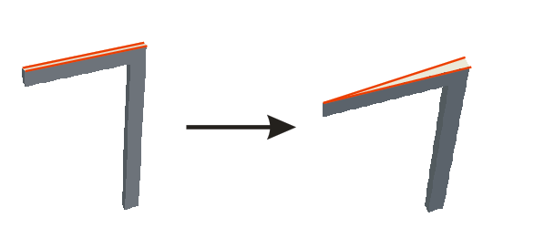

# wedgePlease

This is a very simple OpenFOAM utility for converting a 2D mesh to axisymmetric.
It is a modification of the flattenMesh utility distributed with OpenFOAM.
The supplied examples are a modification of the case that comes with the more elaborate utility [makeAxialMesh](http://openfoamwiki.net/index.php/Contrib/MakeAxialMesh).
One supplied [example](/caseBM) uses `wedgePlease` to convert a blockMesh to an OpenFOAM axialMesh.
The other [example](/caseBF) uses it to convert a fluentMesh.
The supplied examples deal with the associated mesh cleanup (collapse 0-length edges, remove 0-face patches) which is the same as in the case of `makeAxialMesh`.

Last changest were made using OpenFOAM v7.0.

This software is not part of OpenFOAM.
See the OpenFOAM website [openfoam.org](https://openfoam.org/), unofficial wiki
[openfoamwiki.net](https://openfoamwiki.net/index.php/Main_Page) and the community forum
[cfd-online.com](https://www.cfd-online.com/Forums/openfoam/).

## Getting Started

An OpenFOAM installation is required to run the code. This code was run on Centos 6.6 (Rocks 6.2 Sidewinder).

Run `Allwmake` in the utility directory to compile it.

Run `Allmesh` in the [`caseBM`](/caseBM) or [`caseFM`](/caseFM) directory to convert the mesh. Then run `paraFoam` in the case directory to view the results.

## Functionality

* Assumes a 2D mesh in the XY plane.
* The Y axis becomes the axis of symmetry.
* The command `wedgePlease -angle 5` reshapes the mesh points to form the wedge.
* For older versions of OpenFOAM git-checkout the of3 tag.

## Feedback

Any feedback is apreciated - krebeljk()gmail.com.

## Author

* **Kristjan Krebelj**

## License

This project is licensed under the GPU License - see the [LICENSE.md](LICENSE.md) file for details.

## Acknowledgments

* The work was supported by the [Laboratory for Numerical Modelling and Simulation - LNMS](http://lab.fs.uni-lj.si/lnms/).
